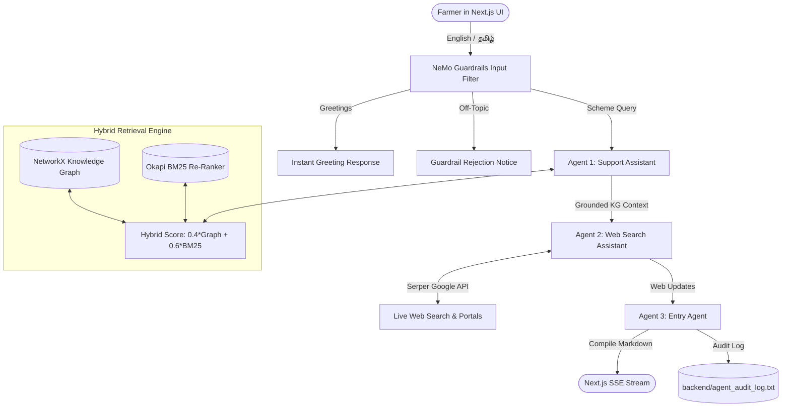

# 🌱 TN Uzhavan RAG: Multi-Agent Customer Support System

> **Tamil Nadu Agricultural Schemes & Farmer Welfare Platform**  
> Powered by **Knowledge Graph RAG + Okapi BM25 Re-Ranking + NVIDIA NeMo Guardrails + Serper Web Search + Next.js Bilingual UI**

---

## 🏗 System Architecture



---

## ✨ Key Features

- **🌐 Hybrid Knowledge Graph & BM25 Re-Ranking**:
  - Entity extraction and NetworkX DiGraph relationship modeling (`BELONGS_TO`, `HAS_TAG`, `LOCATED_IN`).
  - Okapi BM25 statistical lexical re-ranking ($k_1=1.5, b=0.75$) for high-precision retrieval across 140+ entities and relationships.
- **🛡️ NVIDIA NeMo Guardrails Policy Enforcement**:
  - Colang dialog rules (`backend/config/general.co`) intercept greetings in 0ms and enforce strict domain boundaries against out-of-scope queries.
- **🤖 Collaborative Multi-Agent Pipeline**:
  - **Agent 1 (Assistant)**: Queries internal Knowledge Graph RAG for grounded facts.
  - **Agent 2 (Web Search Assistant)**: Queries Google via Serper for active portal links & live deadlines.
  - **Agent 3 (Entry Agent)**: Compiles structured markdown and maintains persistent Q&A logging in `backend/agent_audit_log.txt`.
- **🗣️ Bilingual & Voice Support (English & தமிழ்)**:
  - Full Unicode Tamil support with speech-to-text voice recognition for farmers.
- **⚡ 0ms Client-Side Cached UI**:
  - Next.js with in-memory caching for instant tab transitions without refresh lag.

---

## 📁 Repository Structure

```
├── backend/
│   ├── config/                     # NeMo Guardrails configuration & Colang flows
│   │   ├── config.yml
│   │   └── general.co
│   ├── data/                       # Multilingual scheme datasets
│   │   ├── schemes_en.csv
│   │   └── schemes_ta.csv
│   ├── graph_storage/              # Persisted JSON Knowledge Graph stores
│   │   ├── knowledge_graph_en.json
│   │   └── knowledge_graph_ta.json
│   ├── agent_audit_log.txt         # Persistent agent Q&A audit log
│   ├── crew_engine.py              # Multi-Agent execution pipeline
│   ├── guardrails_engine.py        # NeMo Guardrails policy filter
│   ├── kg_rag.py                   # Knowledge Graph + Okapi BM25 Hybrid Engine
│   └── main.py                     # FastAPI server with SSE streaming endpoints
├── database/
│   ├── fixtures/                   # Test fixtures & scheme JSON records
│   ├── migrations/                 # Schema migration version files
│   └── seeds/                      # Seed scripts to populate graph stores
├── docs/                           # Architecture, design, progress & deployment docs
├── evaluation/                     # Automated benchmarks and accuracy test suite
│   ├── metrics.py
│   ├── run_evaluation.py
│   └── sample_questions.json
├── frontend/                       # Next.js bilingual frontend
├── infrastructure/                 # Dockerfiles & Nginx reverse proxy configuration
├── .env.example                    # Environment variables template
├── docker-compose.yml              # Multi-container Docker deployment
├── Makefile                        # Build & test automation shortcuts
├── README.md                       # Main project documentation
└── requirements.txt                # Python backend dependencies
```

---

## 🚀 Quick Start Guide

### 1. Configure Environment Variables
```bash
cp .env.example .env
# Fill in your OPENAI_API_KEY and SERPER_API_KEY inside .env
```

### 2. Start Backend (FastAPI + KG-RAG)
```bash
cd backend
pip install -r ../requirements.txt
uvicorn main:app --reload --port 8000
```

### 3. Start Frontend (Next.js)
```bash
cd frontend
yarn install
yarn dev
```
Open **`http://localhost:3000`** in your browser.

---

## 📊 Automated Evaluation Benchmarks

Run the built-in evaluation suite to verify retrieval precision and guardrail accuracy:
```bash
make eval
# OR
python3 evaluation/run_evaluation.py
```
